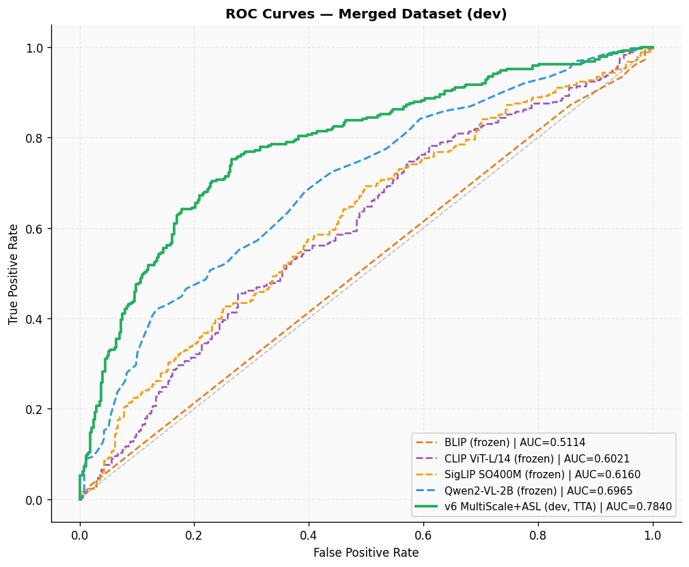
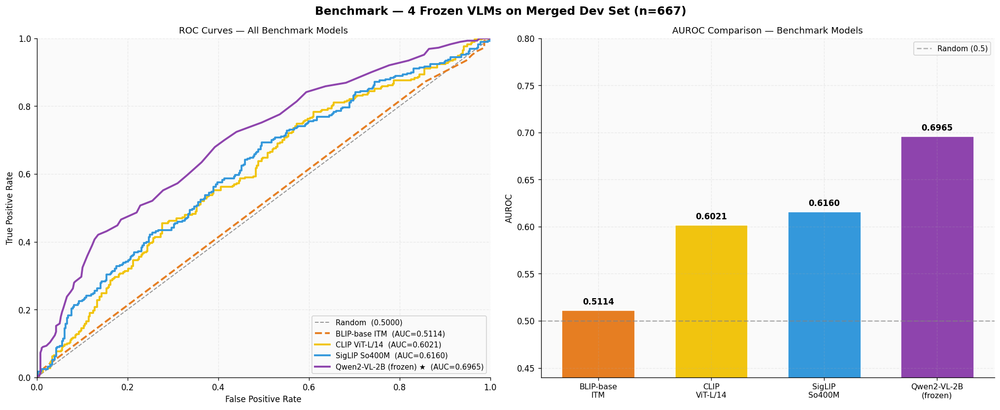

# Phân loại Multimodal Hateful Meme

Dự án này tập trung vào việc phát hiện và phân loại nội dung độc hại (hateful content) trong các meme trên mạng xã hội bằng cách sử dụng các mô hình ngôn ngữ - thị giác (Vision-Language Models - VLMs). Bài toán giải quyết thách thức trong việc kết hợp thông tin đa phương thức (hình ảnh và văn bản) để hiểu được ngữ cảnh, sự mỉa mai và các hàm ý ẩn sâu bên trong meme.

## 📌 Tổng quan dự án
- **Mục tiêu:** Xây dựng và tinh chỉnh (fine-tune) mô hình đa phương thức để phân loại chính xác meme dựa trên cả đặc trưng hình ảnh và văn bản.
- **Dữ liệu:** Dựa trên các tập dữ liệu tiêu chuẩn như Hateful Meme và Memotion để huấn luyện và đánh giá. *(Lưu ý: Dữ liệu thô và file trọng số mô hình không được đính kèm trong repository này do kích thước lớn).*
- **Kỹ thuật áp dụng:** Tích hợp các mô hình Vision-Language (như Qwen2-VL), sử dụng kỹ thuật Low-Rank Adaptation (LoRA/PEFT) để tối ưu hóa tài nguyên phần cứng trong quá trình fine-tuning.

## 🗂 Cấu trúc thư mục
- `build_merged_dataset.py`: Mã nguồn tiền xử lý, làm sạch và đồng bộ các bộ dữ liệu meme khác nhau về một định dạng chuẩn.
- `dataset_statistics.ipynb`: Exploratory Data Analysis (EDA) - Thống kê và trực quan hóa phân phối của tập dữ liệu huấn luyện.
- `predict_personal_images_v6.ipynb`: Notebook hỗ trợ chạy suy luận (inference) để kiểm thử mô hình trên các hình ảnh tùy chỉnh (in-the-wild images).
- `sumary/`: Chứa các notebook tổng hợp, đánh giá mô hình và biểu đồ kết quả (đường cong ROC, tiến trình huấn luyện...).

## 🚀 Cài đặt và Sử dụng
Clone repository và cài đặt các môi trường phụ thuộc cần thiết:
```bash
git clone https://github.com/yourusername/hateful-meme-classification.git
cd hateful-meme-classification
pip install -r requirements.txt
```

## 📊 Kết quả đánh giá
Hiệu suất của mô hình được đánh giá thông qua các độ đo phân loại tiêu chuẩn bao gồm AUROC, Accuracy và F1-score.


*(Biểu đồ: So sánh đường cong ROC giữa các phương pháp tiếp cận khác nhau)*


*(Biểu đồ: Đánh giá Benchmark hiệu năng mô hình)*

## 🛠 Công nghệ sử dụng (Tech Stack)
- **Frameworks:** PyTorch, Hugging Face Transformers, PEFT
- **Thư viện:** Pandas, NumPy, Scikit-learn, Matplotlib
- **Kiến trúc mô hình:** Multimodal Transformers (Qwen2-VL)
